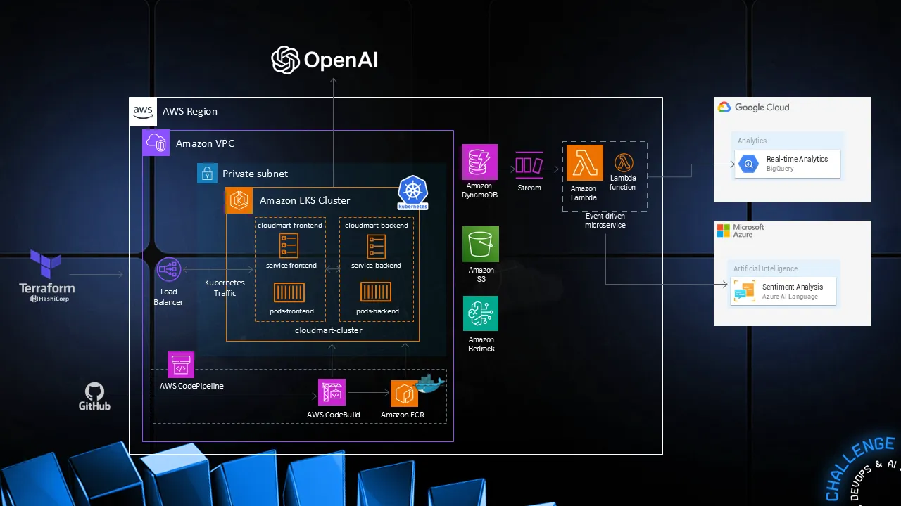

<p align="center">
  
  
## ☁️ MultiCloud, DevOps & AI Challenge — Day 3 — Building and Automating CI/CD Pipeline to Test, Stage and Deploy our E-Commerce Application. ☁️

This is part of the third project of the Multicloud, Devops and AI Challenge!

In this project we will be build and automating our E-commerce application testings and deployments for production using AWS CodePipeline so that every time we push changes to our application they are built and deployed automatically. 


<h2>Environments and Technologies Used</h2>

  - Amazon Web Services
  - Github Codespaces
  - AWS CodePipeline
  - AWS CodeBuild
  - Docker
  - Amazon Elastic Container Registry
  
  
<h2>Key Features</h2>  

✅Automated CI/CD Pipeline:

- Built a fully automated CI/CD pipeline using AWS CodePipeline to streamline the testing and deployment process for an E-commerce application.

- Every push to the GitHub repository triggers the pipeline, ensuring seamless and continuous delivery.

✅Integration with GitHub:

- Connected the pipeline to a GitHub repository to monitor changes in the main branch.

- Used GitHub OAuth tokens for secure integration with AWS CodePipeline.

✅Automated Builds with AWS CodeBuild:

- Leveraged AWS CodeBuild to automatically build the application whenever changes are pushed to the repository.

- Configured build specifications (buildspec.yml) to define build steps, such as installing dependencies, running tests, and packaging the application.


<h2>Step by Step Instructions</h2>

***1. Repo configuration***


NOTE: Keep in mind this is for a Linux environment, check the AWS documentation to install it in your supported OS.


   curl "https://awscli.amazonaws.com/awscli-exe-linux-x86_64.zip" -o "awscliv2.zip"
unzip awscliv2.zip
sudo ./aws/install


We then do `AWS configure` and enter our access and secret key along with the region. Output format set to JSON. With this command we will double check that our credentials are put in place for CLI:

```
aws sts get-caller-identity
```

We will also be installing terraform for this project:

```
sudo wget -O - https://apt.releases.hashicorp.com/gpg | sudo gpg --dearmor -o /usr/share/keyrings/hashicorp-archive-keyring.gpg
echo "deb [arch=$(dpkg --print-architecture) signed-by=/usr/share/keyrings/hashicorp-archive-keyring.gpg] https://apt.releases.hashicorp.com $(lsb_release -cs) main" | sudo tee /etc/apt/sources.list.d/hashicorp.list
sudo apt update && sudo apt install terraform
```
We will then proceed with installing the Docker CLI and Docker in Docker (Github Codespaces Setup)

```
curl -fsSL https://download.docker.com/linux/static/stable/x86_64/docker-20.10.9.tgz -o docker.tgz \
tar -xzf docker.tgz \
sudo mv docker/docker /usr/local/bin/ \
rm -rf docker docker.tgz
```

`Ctrl + p` on Github Codespace > `Add Dev Container Conf files` > modify your active configuration > click on Docker (Docker-in-Docker)


***2.  Creating Resources using Terraform***

We will be cloning the files of the day 2 challenge in order to run our e-commerce CloudMart.

```
gh repo clone nilsojc/multicloud2
```

Then, we will deploy our main.tf file for Terraform for setting up IAM roles and engage with the Cloudmart application:

```
provider "aws" {
  region = "us-east-1"  # Replace with your desired region
}

# DynamoDB Table for Products
resource "aws_dynamodb_table" "cloudmart_products" {
  name           = "cloudmart_products"
  billing_mode   = "PAY_PER_REQUEST"
  hash_key       = "product_id"

  attribute {
    name = "product_id"
    type = "S"
  }
}

# DynamoDB Table for Orders
resource "aws_dynamodb_table" "cloudmart_orders" {
  name           = "cloudmart_orders"
  billing_mode   = "PAY_PER_REQUEST"
  hash_key       = "order_id"

  attribute {
    name = "order_id"
    type = "S"
  }
}

# DynamoDB Table for Tickets
resource "aws_dynamodb_table" "cloudmart_tickets" {
  name           = "cloudmart_tickets"
  billing_mode   = "PAY_PER_REQUEST"
  hash_key       = "ticket_id"

  attribute {
    name = "ticket_id"
    type = "S"
  }
}

# IAM Role for Lambda function
resource "aws_iam_role" "lambda_role" {
  name = "cloudmart_lambda_role"

  assume_role_policy = jsonencode({
    Version = "2012-10-17"
    Statement = [
      {
        Action = "sts:AssumeRole"
        Effect = "Allow"
        Principal = {
          Service = "lambda.amazonaws.com"
        }
      }
    ]
  })
}

# IAM Policy for Lambda function
resource "aws_iam_role_policy" "lambda_policy" {
  name = "cloudmart_lambda_policy"
  role = aws_iam_role.lambda_role.id

  policy = jsonencode({
    Version = "2012-10-17"
    Statement = [
      {
        Effect = "Allow"
        Action = [
          "dynamodb:Scan",
          "logs:CreateLogGroup",
          "logs:CreateLogStream",
          "logs:PutLogEvents"
        ]
        Resource = [
          aws_dynamodb_table.cloudmart_products.arn,
          aws_dynamodb_table.cloudmart_orders.arn,
          aws_dynamodb_table.cloudmart_tickets.arn,
          "arn:aws:logs:*:*:*"
        ]
      }
    ]
  })
}

# Lambda function for listing products
resource "aws_lambda_function" "list_products" {
  filename         = "list_products.zip"
  function_name    = "cloudmart-list-products"
  role             = aws_iam_role.lambda_role.arn
  handler          = "index.handler"
  runtime          = "nodejs20.x"
  source_code_hash = filebase64sha256("list_products.zip")

  environment {
    variables = {
      PRODUCTS_TABLE = aws_dynamodb_table.cloudmart_products.name
    }
  }
}

# Lambda permission for Bedrock
resource "aws_lambda_permission" "allow_bedrock" {
  statement_id  = "AllowBedrockInvoke"
  action        = "lambda:InvokeFunction"
  function_name = aws_lambda_function.list_products.function_name
  principal     = "bedrock.amazonaws.com"
}

# Output the ARN of the Lambda function
output "list_products_function_arn" {
  value = aws_lambda_function.list_products.arn
}
```


***2. Configuring Agents in Amazon Bedrock***

In this step, we will configure Amazon Bedrock so that we can utilize `Claude 3 Sonnet` along with the creation of our AI agents with instructions and permissions specified. 

First, we configure Amazon Bedrock to allow `Claude 3 Sonnet`:

(Video)

NOTE: Make sure that you have access granted by checking the AWS Console.

Then, we will begin creating our agents

```
aws bedrock-agent create-agent \
  --agent-name cloudmart-product-recommendation-agent \
  --agent-resource-role-arn arn:aws:iam::137068224350:role/Cloudmart \
  --foundation-model anthropic.claude-v3 \
  --instruction file://agents.yaml
```
NOTE: You can check what the instructions are in the `agents.yaml` file found in my repo!

Then, we will be configuring IAM access for invoking lambda functions

```
aws iam put-role-policy --role-name Cloudmart --policy-name BedrockAgentLambdaAccess --policy-document file://policy.json
```

We will now create an action group in Amazon Bedrock that utilizes a Lambda function "cloudmart-list-products" and an OpenAPI schema, defined in the AWS console.


We will now prepare our agents with the following command:

```
aws bedrock-agent prepare-agent --agent-id 
```


Now, we will create an action group that will point to our current Lambda function "cloudmart-list-products"
***3. Redeploy the backend with AI Assistants***


<h2>Conclusion</h2>

In this project, I learned how 